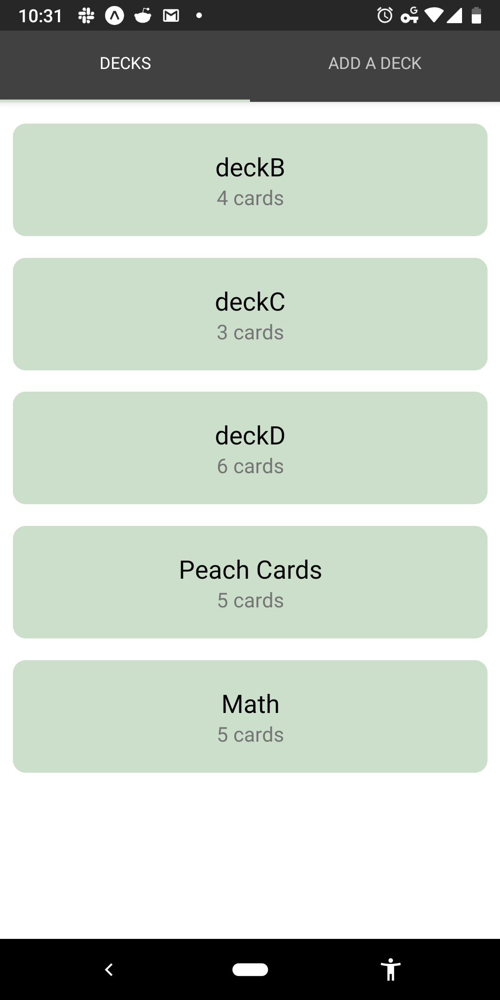
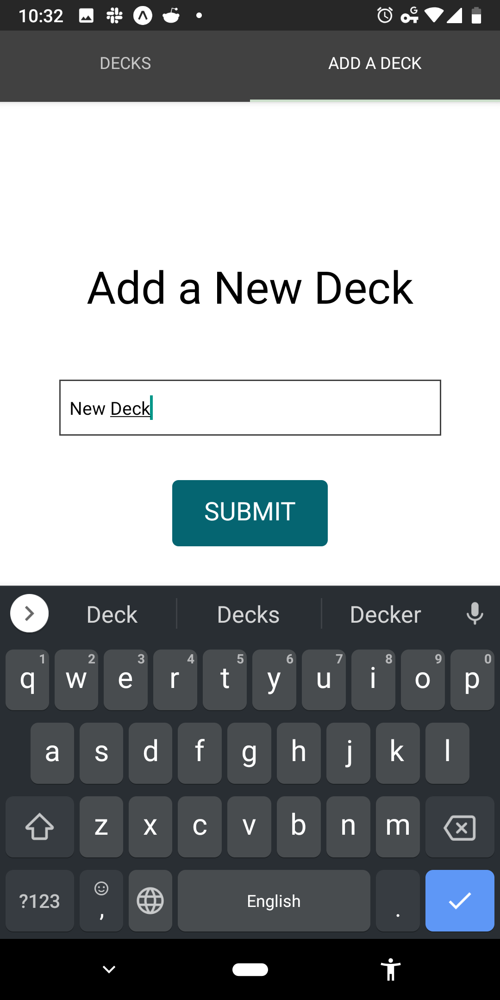
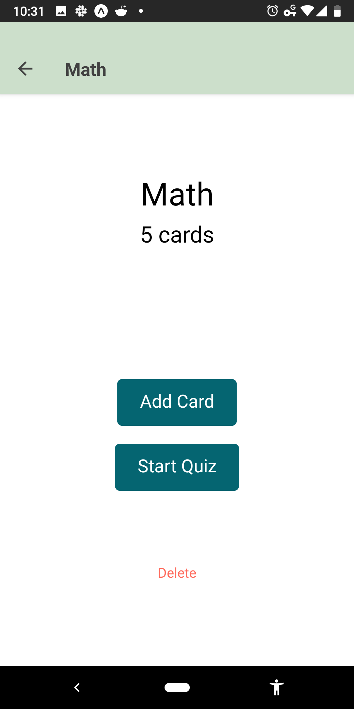
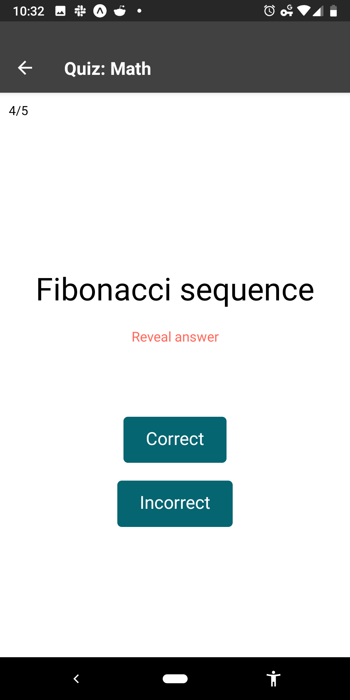
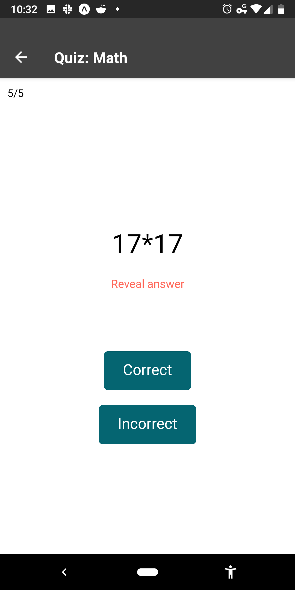
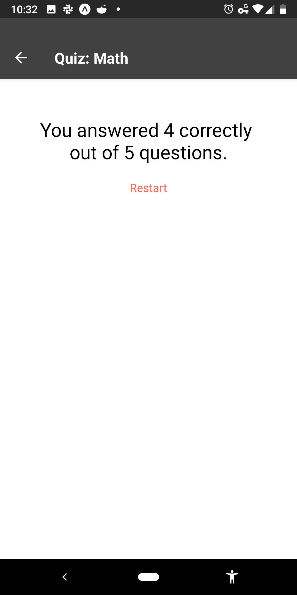

# RN Flashcards 

This app is the final assessment project for Udacity's React Native course. 
[Create React Native App](https://github.com/react-community/create-react-native-app) boilerplate was used to bootstrap other build tools and dependencies for React Native app development.

## Starting the App

You will need to have Node 8.10.0 or higher as specified in the version of `create-react-app` [getting started section](https://github.com/react-community/create-react-native-app#getting-started). The app can be started with the following commands:

```
npm install
npm start
```
The npm start command starts the Expo CLI server. [Expo app](https://expo.io/) is required to run on Android or iOS.  

## Functionality

### Views

There are four main views:

- Main (List of Decks)

- Add Deck / Add Card


- Deck Options

- Quiz 






## Contributing and Licensing

Any comment or pull request will be greatly appreciated. Licensed under the MIT License and extends [the copyright and the license notices of Facebook](https://github.com/facebook/create-react-app/blob/master/LICENSE).
